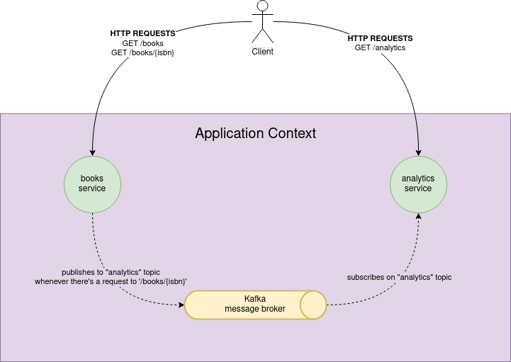

# Micronaut with Kafka

A microservices application about book analysis as an example of using Micronaut framework with Apache Kafka. This example is taken from Micronaut guide and is available at [this link](https://guides.micronaut.io/latest/micronaut-kafka-maven-kotlin.html).

## Services

- `books`: It returns a list of books. It uses a domain consisting of a book name and ISBN. It also publishes a message in Kafka every time a book is accessed.
- `analytics`: It connects to Kafka to update the analytics for every book (a counter). It also exposes an endpoint to get the analytics.

## Architecture Overview

